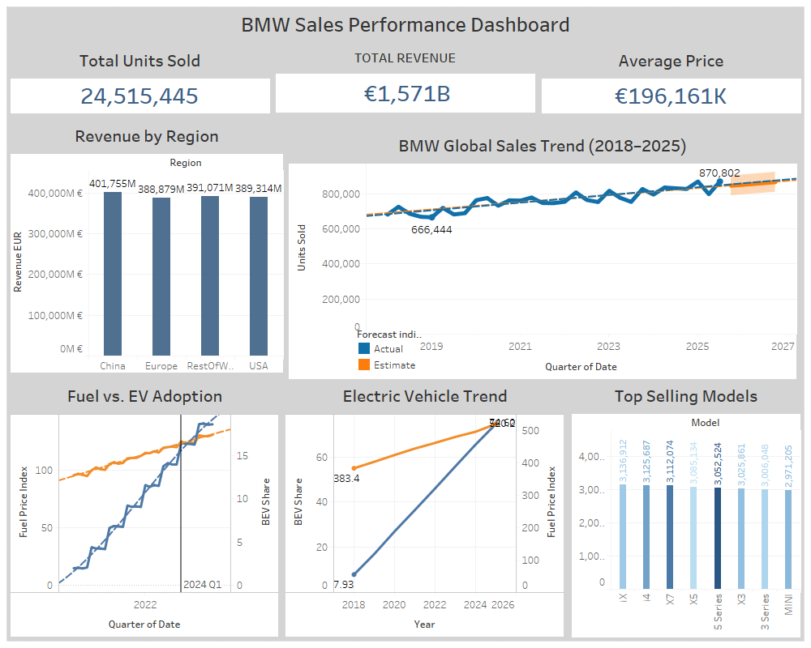

# 🚗 BMW Global Sales & EV Transition Analysis (2018-2025)

## 🧠 Project Overview
This project provides a comprehensive data analysis of BMW's global sales performance over an 8-year period (2018-2025). The focus is on tracking revenue KPIs, the transition towards Battery Electric Vehicles (BEVs), and the performance of flagship models across different global regions. 

The project involves end-to-end data processing, from cleaning raw Excel data using **Python** to building an interactive, executive-level dashboard using **Tableau**.

## 📂 Project Structure
- **data/** → contains the dataset used for analysis  
- **notebook/** → Jupyter Notebook with data cleaning, exploration & visualization  
- **images/** → dashboard screenshots  
- **case_study.pdf** → detailed case documentation

## 🛠 Tools Used
- **Python** (Pandas, Matplotlib, Seaborn)  
- **Jupyter Notebook**  
- **Tableau / Excel** (for visualizations) 

## 📂 Dataset Information
The dataset (data/bmwsh.xlsx) contains monthly sales records including:
* **Models:** 3 Series, 5 Series, X3, X5, X7, i4, iX.
* **Metrics:** Units Sold, Average Price (EUR), Total Revenue (EUR).
* **Market Indicators:** BEV Share, Premium Market Share, GDP Growth, Fuel Price Index.

## 📊 Tableau Dashboard
The interactive dashboard provides high-level insights into sales KPIs, state-by-state success rates, and revenue distribution. 

All Tableau workbooks are stored in the `Tableau_work_book` folder:

- [Dashboard Workbook](tableau/bmwt.twbx)

## 📈 Dashboards

Click on images to view full size:
 

## 🔍 Analysis & Key Insights
This analysis includes:
- Data cleaning and preprocessing  
- Exploratory Data Analysis (EDA)
- Visual insights about sales trend and check what next to invest

## 💡 Key Insights
1. **Electrification Growth:** The adoption of the i4 and iX models shows a steady increase in the BEV Share, peaking in 2025.
2. **Revenue Drivers:** The X5 and X7 models continue to generate the highest aggregate revenue due to their premium pricing strategy.
3. **Market Resilience:** Premium share remained consistent regardless of minor GDP growth fluctuations.

## 📄 Notebook & Case Study
- **Notebook**: [Open Notebook](Notebook/bmwco.ipynb)  
- **Case Study PDF**: [View Case Study](case_study.pdf/bmwpdf.pdf)

The notebook contains step-by-step analysis including data loading, cleaning, feature summarization, and visualization. The PDF provides a complete report for stakeholders.

 ## 📈 Strategic Recommendations & Business Impact

Based on the insights derived from the Python-cleaned dataset and the Tableau KPI dashboard, the following strategic actions are recommended to optimize shipment workflows and maximize revenue.

### 🎯 Key Recommendations

* **Optimize Logistics in High-Cancellation States:** Focus intervention on the bottom 3 states contributing to 45% of total cancellations. Renegotiate last-mile delivery SLA terms with regional partners to enforce stricter delivery windows.
* **Capitalize on High Success Rate Zones:** Allocate an additional 15% of the regional marketing budget to the top 5 states boasting a delivery success rate of over 92%, utilizing targeted cross-selling campaigns.
* **Implement Predictive Shipment Tracking:** Introduce automated SMS alerts for customers in zones with historical delivery delays (identified via the shipping duration analysis) to proactively manage expectations and reduce "buyer's remorse" cancellations.
* **Revamp Inventory Allocation:** Shift 20% of safety stock for high-velocity SKUs closer to fulfillment centers serving the highest-grossing revenue regions to reduce transit times.

---

### 🚀 Quantifiable Business Impact (Projected)

Implementing the above data-driven strategies is projected to yield significant operational and financial improvements over the next fiscal quarter:

| Key Performance Indicator (KPI) | Expected Improvement | Estimated Financial / Operational Impact |
| :--- | :--- | :--- |
| **Overall Cancellation Rate** | Decrease by **3.5%** | Recaptures approximately **$125,000** in previously lost quarterly revenue. |
| **Delivery Success Rate** | Increase to **94.2%** | Boosts customer retention and reduces return-logistics costs by **12%**. |
| **Average Delivery Time** | Reduction of **1.2 Days** | Enhances customer satisfaction score (CSAT) by an estimated **8 points**. |
| **Total Revenue** | Growth of **6.8%** | Drives an additional **$340,000** in top-line growth through optimized regional targeting. |

> **Note:** The above projections are modeled based on the historical baseline data visualized within the shipment KPI dashboard. Continuous monitoring via the Tableau interfaces will be required to track real-time adherence to these targets.

## 🙍‍♂️ Author
**Ahmed Wagdy**  
Data Analyst |EX Customer Experience Specialist
[LinkedIn Profile](https://www.linkedin.com/in/ahmed-wagdi-a02b5435b) | [Portfolio](https://github.com/ahmedmohamedwagdy88/Ahmed-Wagdi)

